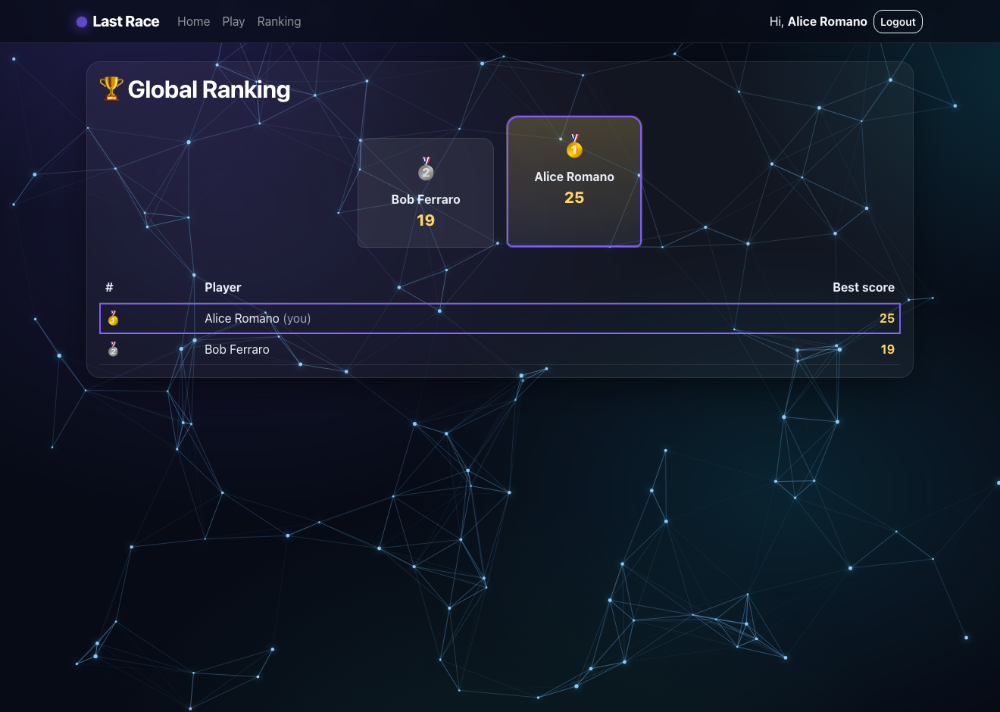
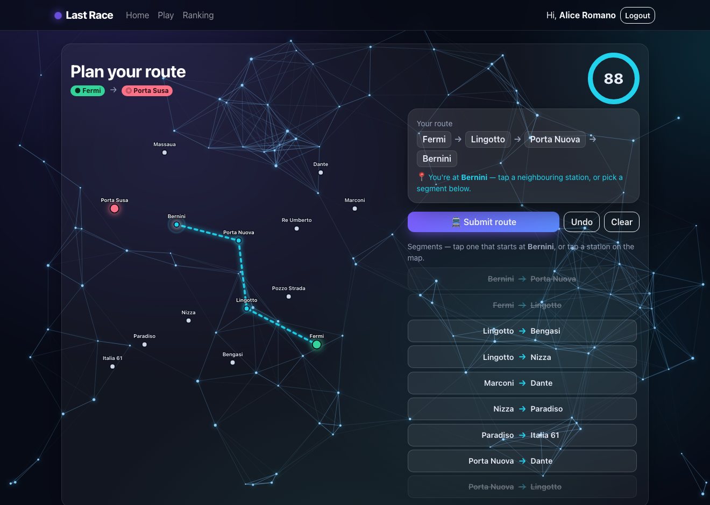

# Exam #1: "Last Race"

## Student: s364600 NAZARIFAZEL MEHRAN

A single-player web game on a fictional underground network. Each game assigns a
random start and destination station (≥3 segments apart); the player has 90
seconds to rebuild the hidden lines and pick a valid route, which is then executed
segment by segment with random events affecting the coin score.

- **Client:** React 19 + Vite + react-bootstrap (`client/`, dev port 5173)
- **Server:** Node + Express 5, SQLite, Passport.js sessions (`server/`, port 3001)
- Run: `cd server; nodemon index.js` and `cd client; npm run dev`

## React Client Application Routes

- Route `/`: home page; shows the public game instructions. Logged-in users get a
  "Play now" button; anonymous users get a login prompt (no network map).
- Route `/login`: login form (username + password).
- Route `/play`: the game itself (Setup → Planning → Execution → Result). Protected.
- Route `/ranking`: global leaderboard of each player's best score. Protected.
- Any other path redirects to `/`.

## API Server

- `POST /api/sessions`
  - request body: `{ username, password }`
  - response: `{ id, username, name }` on success, `401 { error }` on wrong credentials
- `GET /api/sessions/current`
  - response: `{ id, username, name }` if logged in, else `401 { error }`
- `DELETE /api/sessions/current`
  - logs out the current user; response: `204` (no content)
- `GET /api/instructions` (public)
  - response: `{ title, paragraphs: [string] }` — how-to-play text, no network data
- `GET /api/network/full` (auth)
  - response: `[ { id, name, color, stations: [ { id, name, position } ] } ]` — the full
    map with lines, used in the Setup phase
- `GET /api/network/planning` (auth)
  - response: `{ stations: [ { id, name } ], segments: [ { id, stationA:{id,name}, stationB:{id,name} } ] }`
  - the segments carry **no line information** (the player must rebuild the lines)
- `POST /api/games` (auth)
  - starts a new game; the server assigns the start/destination (≥3 segments apart)
  - response: `{ id, start:{id,name}, dest:{id,name}, planningSeconds }`
- `POST /api/games/:id/route` (auth, owner only)
  - request body: `{ segments: [segmentId] }` — the ordered selected segments
  - response (valid): `{ valid:true, steps:[ {index, from, to, event:{description,effect}, coinsAfter} ], score, timedOut }`
  - response (invalid/incomplete): `{ valid:false, reason, score:0, timedOut }`
- `GET /api/ranking` (auth)
  - response: `[ { username, name, bestScore } ]` — best completed-game score per user, highest first

## Database Tables

- Table `users` — registered players; password stored as scrypt `salt` + `hash`.
- Table `lines` — metro lines (unique name + colour).
- Table `stations` — stations (unique name + `x`,`y` map coordinates for drawing).
- Table `line_stations` — ordered membership of a station on a line (`position`); the
  source of truth for topology. A station on >1 line is an interchange.
- Table `segments` — undirected connection between two adjacent stations (canonical
  `station_a_id < station_b_id`), i.e. the selectable "segment".
- Table `segment_lines` — which line(s) serve each segment.
- Table `events` — random events with an `effect` in [−4, +4].
- Table `games` — one row per game (user, start/dest, score, status, start time).
- Table `game_steps` — per-segment execution log (event applied, running coins).

## Main React Components

- `App` (in `App.jsx`): provides the auth context, the nav bar, and the route table.
- `AuthContext` (in `contexts/AuthContext.jsx`): holds the logged-in user, restores
  the session on load, exposes `login`/`logout`.
- `NavHeader` / `ProtectedRoute`: navigation bar; gate for logged-in-only routes.
- `HomePage`, `LoginPage`, `RankingPage` (in `pages/`): the static pages.
- `GamePage` (in `pages/GamePage.jsx`): drives the game phase machine.
- `SetupPhase`: shows the full map and starts a game.
- `PlanningPhase`: the 90-second timed route-builder (segment picker, no lines shown).
- `ExecutionPhase`: replays the server's steps one at a time with the running score.
- `ResultView`: the final score screen.
- `NetworkMap` (SVG): draws the network — coloured lines + stations in Setup, or
  stations only (no lines) in Planning, with start/destination/route highlighting.
- `CircularTimer` (SVG): the animated 90-second countdown ring.

## Screenshots

Ranking page:

During a game (planning phase):

## Users Credentials

| username | password   | notes                          |
| -------- | ---------- | ------------------------------ |
| alice    | alice2026  | has completed games (ranking)  |
| bob      | bob2026    | has completed games (ranking)  |
| carla    | carla2026  | no completed games yet         |

## Use of AI Tools

I used an AI coding assistant (Claude) while building this project. It was used to:

- Scaffold the project structure (client/server split, initial files).
- Draft parts of the Express API, the SQLite schema and seed data, and several
  React components (the game phase machine, the SVG `NetworkMap`, the timer).
- Help write and refine this `README.md`.

How the output was used and verified:

- I reviewed every file before keeping it and made changes where I disagreed with
  the AI's choices or where it did not match the functional specification.
- I ran the application end-to-end (login, planning timer, route validation,
  execution events, ranking) to confirm the behaviour matches the spec.
- I made sure I understand every route, query, validation rule, and component so I
  can explain each design choice and line of code at the oral exam.

No part of the submission was accepted without being read, tested, and understood.
